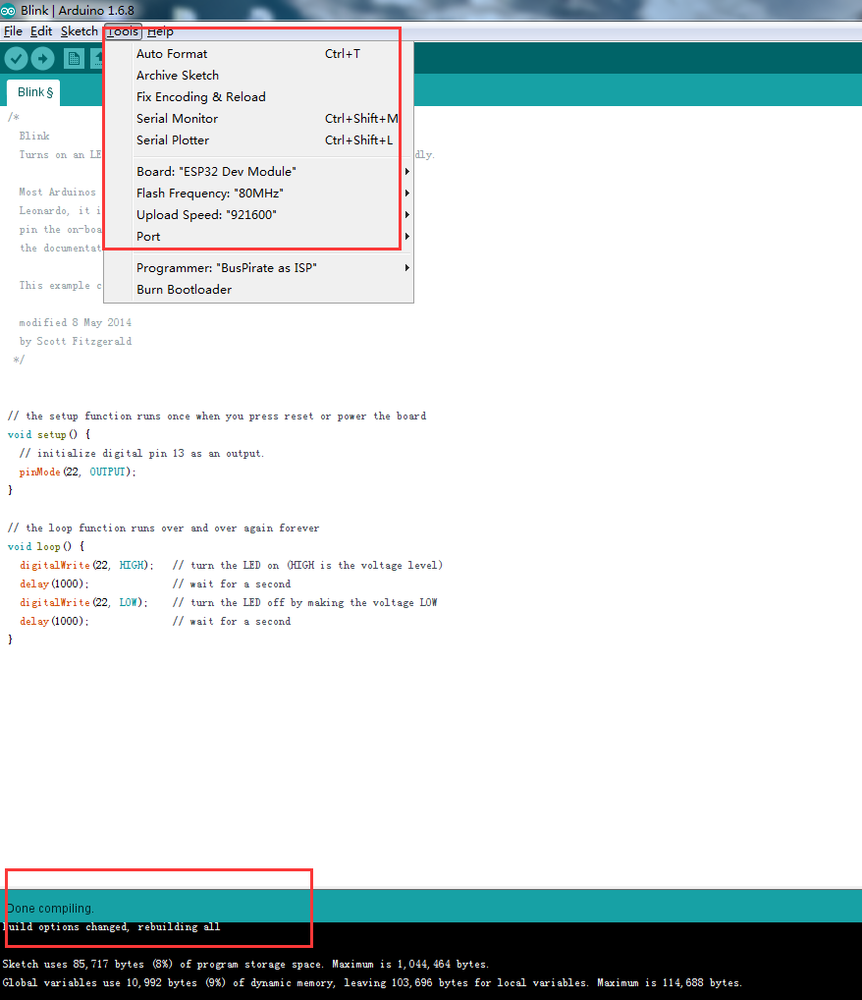

## ESP32 with Windows Arduino IDE
The following was the setup environment for ESP32 with Windows Arduino IDE.  

* [Arduino IDE 1.6.5]() or later
* Windows7/8/10
* [Python2.7](https://www.python.org/downloads/release/python-2712/)
* [pyserial](https://github.com/delongqi/esp32_arduino.git)

### Install Windows Python
##### Download Python(32bit/64bit),and then install it.The previous installation step you can choose a default installation.

##### Make sure add python to path

##### When Complete the python installer,we should check success or not.Open Windows cmd.exe and write "python",if the display is as follows, the installation is successful, otherwise check the installation steps.

### Install Pyserial and Arduino IDE
##### Install Pyserial and Arduino IDE can choose the default installation configuration, there is nothing special to note.

### Install Esp32 Environment

* Download [esp32 files](https://github.com/delongqi/esp32_arduino.git)
* Add esp32 board on Arduino IDE
* Add esp32 compile tool
* Test a simple code

##### Move espressif file to ardurno-xxxx/hardware/

##### Add esp32 compile tool

##### Test a simple code

